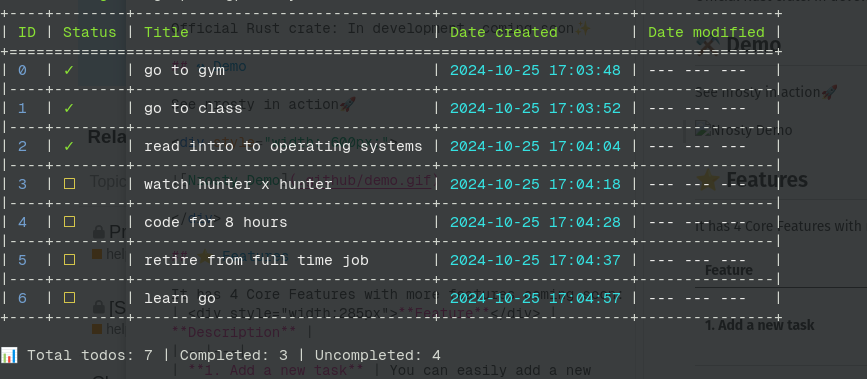

# Nrosty 

Nrosty is an open-source CLI-based task management and todo list app
The goal of nrosty is to provide users with an easy, convenient, privacy-centered, and fast way of managing their tasks without leaving their terminal

Official Rust crate: In development, coming soon✨

#### This app is still in development

## ⚒️ Demo

See nrosty in action🚀

## ⭐ How to use

It has 4 Core Features with more features coming soon:
| 
**Feature**
 | **Description** |
|---|---|
| **1. Add a new task** | You can easily add a new task using the *add "new task"* command |
| **2. Edit task** | You can edit task right in your terminal using the *edit <task_id> "updated task"* command and providing the *task id*|
| **3. Mark task as completed** | Mark tasks as completed using the *done <task_id>* command and providing the *task id* |
| **4. List all tasks** | List all your tasks in a beatiful table using the *list* command |
| **5. Clear all tasks** | Clear all tasks using the *clear* command |
**6. Delete task** | Delete all tasks. Use the command *delete <task_id>*
**7. Help** | Display helpful commands to help you navigate nrosty easily. Use the *help* command

## 📚 Tech Stack

[Rust🦀](https://www.rust-lang.org/) 

## 💻 Installation

1. Download the repo `git clone https://github.com/urdadx/nrosty.git`
2. Change the directory `cd nrosty`
3. Install the dependencies `cargo build`
4. Run the application `cargo run -- add "new todo"`
to add a new todo

## Contributing 🤝

We love our contributors! Here's how you can contribute:

- [Open an issue](https://github.com/urdadx/nrosty/issues) if you believe you've encountered a bug.
- Make a [pull request](https://github.com/urdadx/nrosty/pull) to add new features/make quality-of-life improvements/fix bugs.

## Liscence 📝

MIT

## Give this repo a star ⭐.
